# Tài liệu demo

Tài liệu này mô tả nhanh các luồng sử dụng chính của Elasticsearch Restaurants Map UI bằng ảnh chụp màn hình thực tế.

## Nội dung demo

1. Trạng thái chào mừng khi mở trang
2. Trang hỗ trợ lấy địa chỉ demo
3. Tìm kiếm theo địa chỉ với Google Places Autocomplete
4. Lịch sử tìm kiếm gần đây và danh sách đã lưu
5. Tìm kiếm theo vùng hình tròn
6. Xử lý giới hạn số lượng kết quả
7. Tìm kiếm theo vùng hình chữ nhật
8. Panel kết quả, lọc và sắp xếp
9. Click nhà hàng để focus bản đồ
10. Điều hướng giữa các nhà hàng đã lưu

## Kịch bản demo gợi ý

1. Mở ứng dụng và giới thiệu popup chào mừng cùng các cách nhập điểm tìm kiếm.
2. Mở trang hỗ trợ demo để sao chép một địa chỉ hoặc tọa độ có sẵn.
3. Tìm theo địa chỉ và cho xem danh sách gợi ý autocomplete.
4. Chạy tìm kiếm kiểu hình tròn để minh họa marker cluster và giới hạn kết quả.
5. Chuyển sang kiểu hình chữ nhật và tìm trong vùng giới hạn.
6. Mở sidebar kết quả, lọc theo từ khóa và click vào một nhà hàng.
7. Lưu một nhà hàng, chuyển sang tab Saved và điều hướng quay lại nhà hàng đó trên bản đồ.

## Ảnh minh họa

### 1. Popup chào mừng khi tải trang

Ứng dụng hiển thị phần giới thiệu ngắn về cách tìm kiếm theo địa chỉ, click trên bản đồ hoặc dùng advanced search.

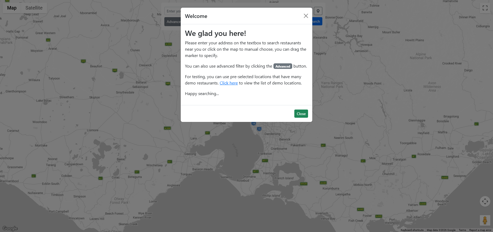

### 2. Trang hỗ trợ địa chỉ demo

Trang hỗ trợ đi kèm giúp lấy nhanh địa chỉ hoặc tọa độ ở các khu vực có nhiều nhà hàng demo.

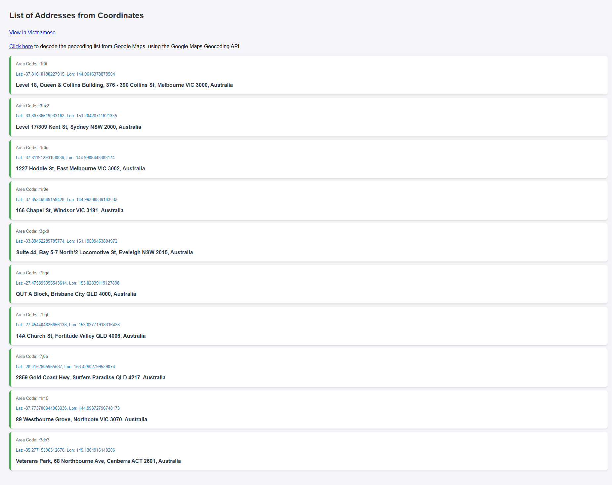

### 3. Tìm kiếm với autocomplete

Khi nhập địa chỉ, Google Places Autocomplete sẽ hiển thị các gợi ý trước khi chạy tìm kiếm.

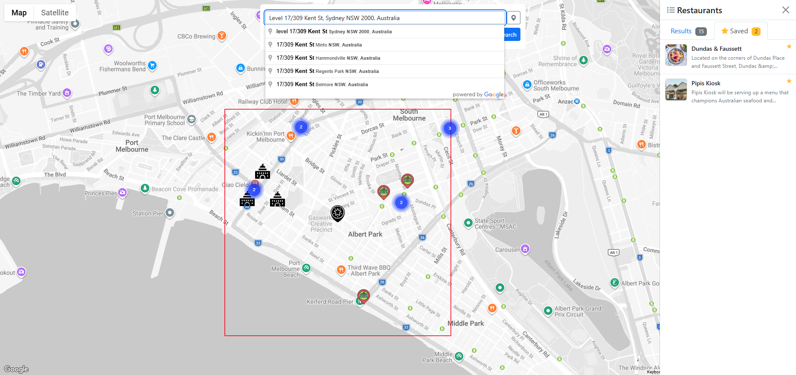

### 4. Lịch sử gần đây và số lượng đã lưu

Sau khi tìm kiếm, panel trên cùng hiển thị lịch sử recent search, còn sidebar kết quả hiển thị số lượng nhà hàng đã lưu.

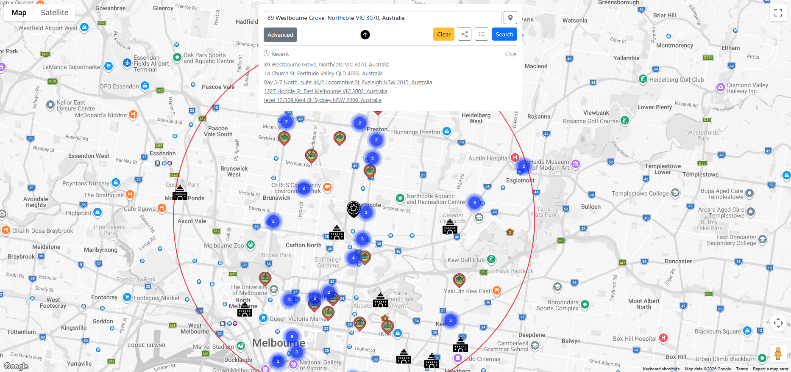

### 5. Tìm kiếm kiểu hình tròn

Chế độ hình tròn cho phép tìm kiếm theo bán kính quanh một tâm đã chọn.

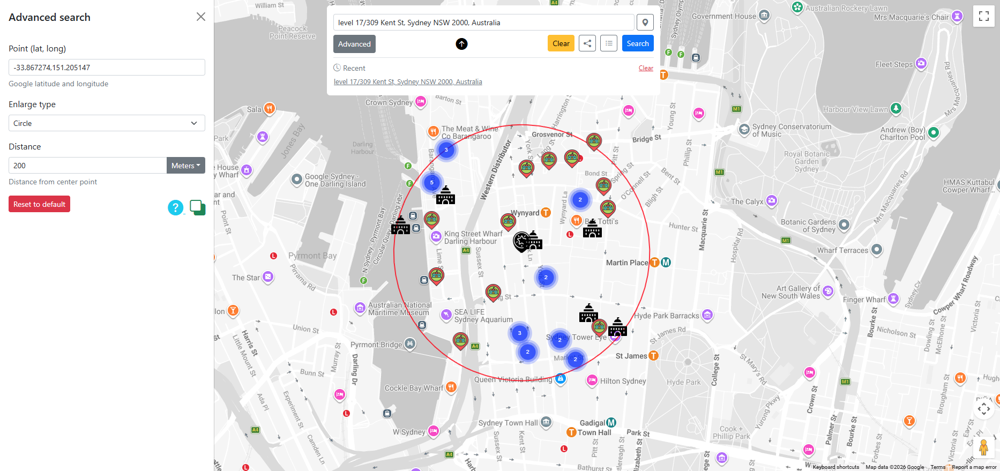

### 6. Giới hạn tối đa 80 kết quả

Nếu backend trả về nhiều hơn số lượng cấu hình, giao diện sẽ thông báo chỉ hiển thị 80 kết quả đầu tiên và gợi ý thu hẹp phạm vi tìm kiếm.

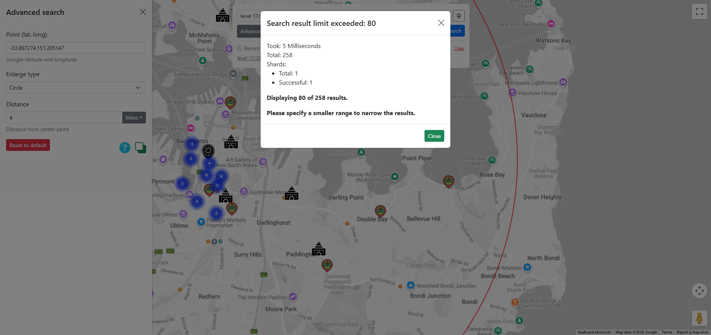

### 7. Tìm kiếm kiểu hình chữ nhật

Chế độ hình chữ nhật cho phép xác định vùng tìm kiếm theo chiều ngang và chiều dọc.

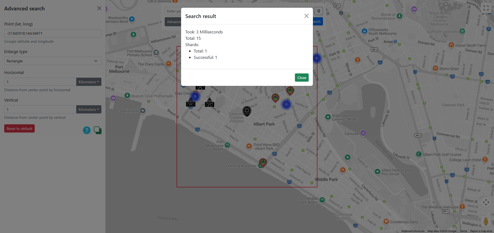

### 8. Kết quả tìm kiếm với sidebar

Sau khi tìm, panel bên phải liệt kê các nhà hàng phù hợp và hiển thị khoảng cách tới từng mục.

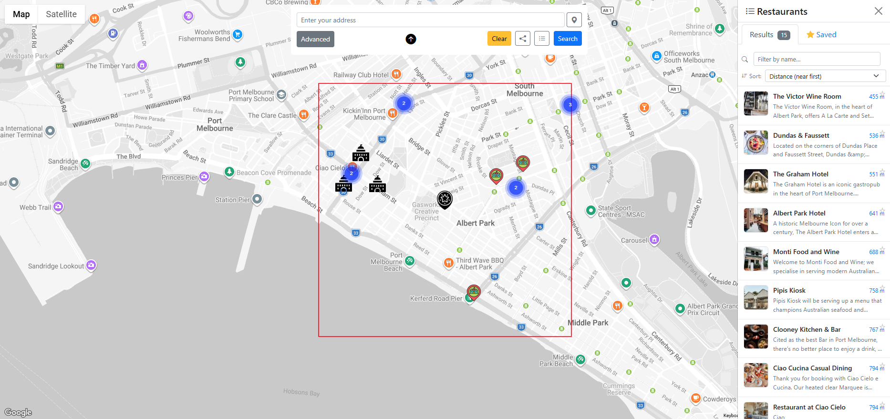

### 9. Lọc trực tiếp trong sidebar

Người dùng có thể lọc danh sách kết quả theo thời gian thực bằng ô tìm kiếm trong sidebar.

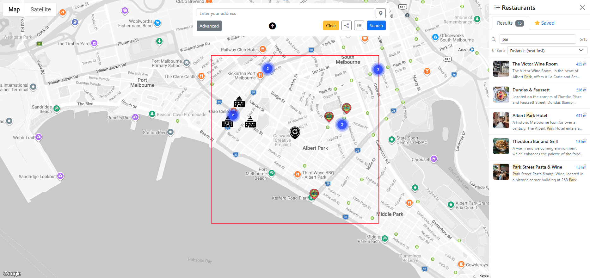

### 10. Click nhà hàng để mở thông tin

Khi click một nhà hàng trong sidebar, bản đồ sẽ focus vào vị trí tương ứng và mở popup chứa ảnh cùng mô tả.

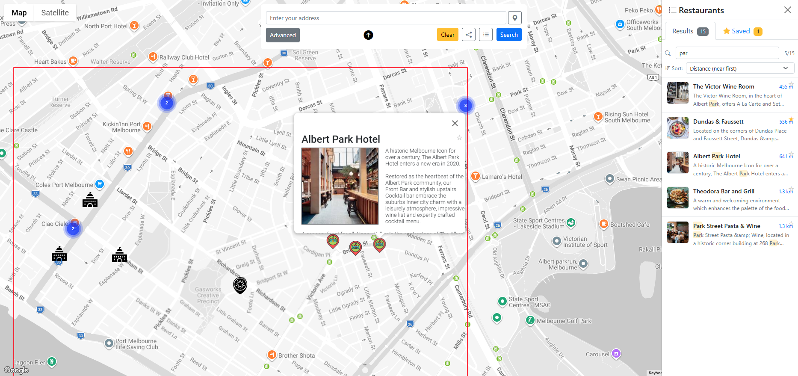

### 11. Điều hướng giữa các nhà hàng đã lưu

Các nhà hàng đã lưu vẫn có thể được mở lại nhanh từ tab Saved trong sidebar.

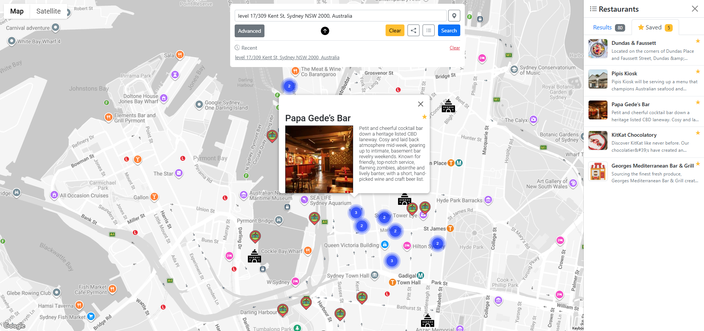

## Trang hỗ trợ liên quan

- [top_location_with_many_restaurants_for_test.vi.html](top_location_with_many_restaurants_for_test.vi.html)
- [reverse_geocoding_list.vi.html](reverse_geocoding_list.vi.html)
